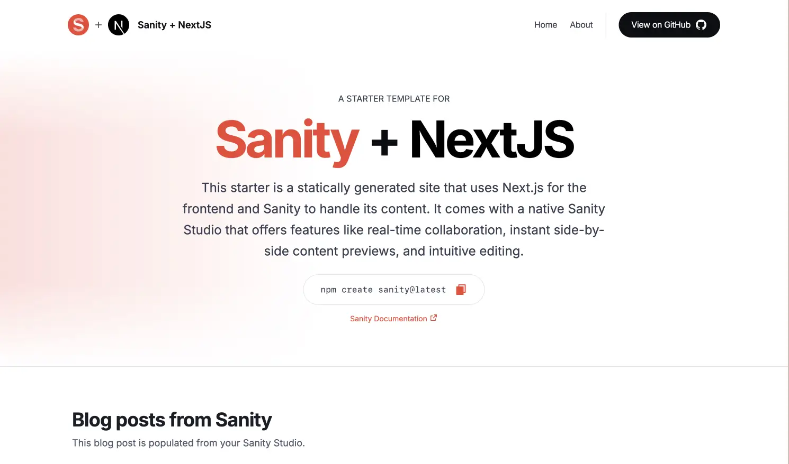
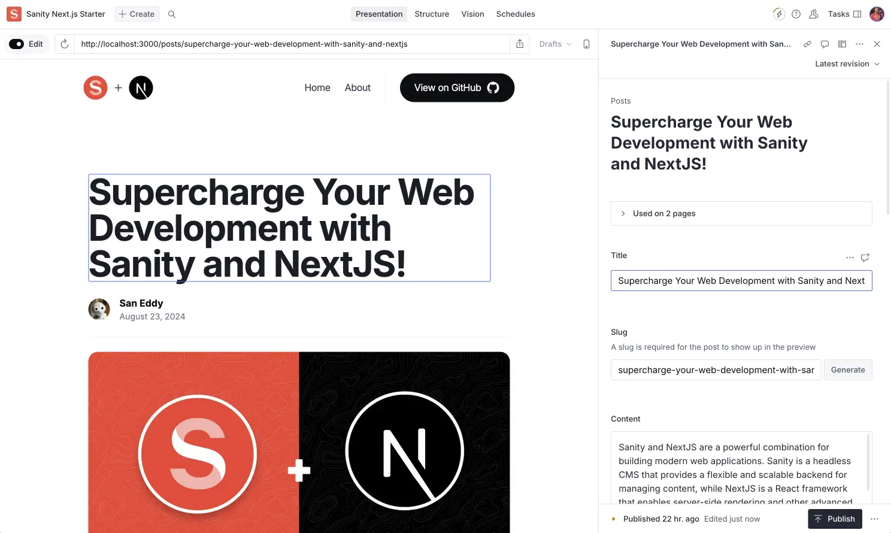

# A statically generated blog example using Next.js and Sanity




This starter is a statically generated blog that uses Next.js App Router for the frontend and [Sanity][sanity-homepage] to handle its content. It comes with a standalone Sanity Studio that offers features like real-time collaboration and visual editing with live updates using [Presentation][presentation].

The Studio connects to Sanity Content Lake, which gives you hosted content APIs with a flexible query language, on-demand image transformations, powerful patching, and more. You can use this starter to kick-start a website, blog or learn these technologies.

## Features

- A performant, static Next.js website with pages and a blog.
  - Pages are configured with a page builder.
  - Blog posts with connected authors.
- Visual editing with live updates with Sanity's [Presentation](https://www.sanity.io/docs/presentation).
- TypeScript setup with [Sanity TypeGen](https://www.sanity.io/docs/sanity-typegen)
- A native and customizable authoring environment. You can [deploy and host the studio with Sanity](https://www.sanity.io/docs/deployment) or your hosting environment of choice.
- Real-time and collaborative content editing with fine-grained revision history.
- Support for block content and the most advanced custom fields capability in the industry.
- Incremental Static Revalidation; no need to wait for a rebuild to publish new content.
- Unsplash integration setup for easy media management.
- [Sanity AI Assist preconfigured for image alt text generation](https://www.sanity.io/docs/ai-assist?utm_source=github.com).

## Demo

### [https://next-blog.sanity.build](https://next-blog.sanity.build)

## Important files and folders

| File/Directory           | Description                                             |
| ------------------------ | ------------------------------------------------------- |
| **studio/**              |                                                         |
| `src/schemaTypes/`       | Directory where Sanity Studio content types are defined |
| `env.local`              | Environment variables for local development             |
| `sanity.cli.ts`          | Config file for Sanity CLI                              |
| `sanity.config.ts`       | Sanity config                                           |
| **nextjs-app/**          |                                                         |
| `app/[slug]/page.tsx`    | Route for a page                                        |
| `app/api/draft/route.ts` | Serverless route for triggering Next.js Draft Mode      |
| `app/components/`        | Shared components                                       |
| `app/posts/page.tsx`     | Route for a blog posts                                  |
| `app/layout.tsx`         | Global layout for the app                               |
| `app/page.tsx`           | Route for index page                                    |
| `sanity/lib/client.ts`   | Sanity client configured                                |
| `sanity/lib/fetch.ts`    | Utility for fetching data from Sanity                   |
| `sanity/lib/queries.ts`  | GROQ queries used across the app                        |
| `env.local`              | Environment variables for local development             |
| `sanity-typegen.json`    | TypeGen config                                          |
| `sanity.types.ts`        | Generated file of schema and query types                |
| `tailwind.config.ts`     | Tailwind config`                                        |

## Configure your Sanity Studio

### Step 1. Change directories to your Sanity Studio

```bash
cd studio
```

### Step 2. Install dependencies

```bash
npm install
```

### Step 3 Create a new Sanity project and dataset

```bash
npx sanity init --bare
```

You will be prompted with an output that contains the project ID and dataset name.

```bash
Success! Below are your project details:

Project ID: rjtcllfw
Dataset: production

You can find your project on Sanity Manage — https://www.sanity.io/manage/project/rjtcllfw
```

Your `projectI ID` is not sensitive information

### Step 4. Set up environment variables

```bash
cp -i .env.local.example .env.local
```

Next, populate the `.env.local` file with the project ID and dataset name provided by the Sanity CLI in the previous step, or by visiting the [Sanity Manage Console](https://manage.sanity.io/)

### Step 5. Optionally seed content by importing a dataset

If you want to start with some sample content, you can import the provided dataset (demoData.tar.gz) into your Sanity project. This step is optional but can be helpful for getting started quickly.

To import the dataset, run the following command in your terminal:

```bash
npx sanity dataset import demoData.tar.gz production
```

This assumes your dataset is named `production`. If your dataset is named differently, replace `production` with the name of your dataset.

### Step 6. Run your Sanity Studio locally

At this point, when you run your Sanity Studio, you'll see a message indicating that Presentation needs to be configured.


We'll address this in the next section when we set up the Next.js app.

```bash
npm run dev
```

> [!TIP]
> In this demo starter, we are using TypeScript. After making changes to your schema, you'll need to extract the Sanity Studio Schema so that you can use that JSON file to generate TypeScript types for your Next.js app.

```bash
npm run extract-types
```

This command is running `sanity schema extract --enforce-required-fields` under the hood. Learn more about [extracting types](https://www.sanity.io/docs/sanity-typegen#b79c963e4cf4).

## Configure your Next.js app

### Step 1. Change directories to your Next.js app

```bash
cd nextjs-app # from the root of the repo
```

### Step 2. Install dependencies

```bash
npm install
```

### Step 3. Set up environment variables

```bash
cp -i .env.local.example .env.local
```

You can now populate `NEXT_PUBLIC_SANITY_PROJECT_ID` and `NEXT_PUBLIC_SANITY_DATASET` by running the following command. Select your project and dataset when prompted and select NO when asked "Would you like to add configuration files for a Sanity project":

```bash
npm create sanity@latest -- --env=.env.local
```

#### Creating a read token

Before you can run the project you need to setup a read token (`SANITY_API_READ_TOKEN`), it's used for authentication by Sanity's Presentation tool and pulling content while in draft mode.

1. Go to [manage.sanity.io](https://manage.sanity.io/) and select your project and select your project in "Project" dropdown.
2. Click on the `🔌 API` tab.
3. Click on `+ Add API token`.
4. Name it "NextJS / Presentation READ Token" and set `Permissions` to `Viewer` and hit `Save`.
5. Copy the token and add it to your `.env.local` file.

```bash
SANITY_API_READ_TOKEN="<paste your token here>"
```

### Step 4. Run your Next.js app locally

```bash
npm run dev
```

> [!Note]
> we are generating types automatically by running `"predev": "npm run typegen"` in our package.json file. This is optional, but will build your `sanity.types.ts` file automatically. Learn more about [Sanity TypeGen](https://www.sanity.io/docs/sanity-typegen).

```bash
npm run extract-types
```

This command is running `sanity typegen generate` under the hood. Learn more about [generating types](https://www.sanity.io/docs/sanity-typegen).

## Deploying the Sanity Studio and Next.js app to production

### Deploy your Sanity Studio

To deploy your Sanity Studio, follow these steps:

1. You'll likely need a different .env file for production, so that you can set a different `SANITY_STUDIO_PREVIEW_URL` to match the domain you will deploy your Next.js app to. Copy the .env.local file to .env.production and set the correct environment variables.

   ```bash
   cp -i .env.local .env.production
   ```

2. In your terminal use the following command to deploy the Studio to Sanity's servers. [Learn more about deploying to Sanity](https://www.sanity.io/docs/deployment).

   ```bash
   npx sanity deploy
   ```

3. When prompted, choose a unique hostname for your Studio. This will be the URL where your Studio is accessible.

4. Once the deployment is complete, you'll receive a URL for your deployed Sanity Studio. It will look something like:

   ```
   https://your-project-name.sanity.studio
   ```

5. You can now access and use your Sanity Studio from this URL from any device with an internet connection.

   Remember to redeploy your Studio whenever you make changes to its configuration or schema.

> [!NOTE]
> Make sure you have the necessary permissions to deploy. If you're working in a team, check with your project owner or administrator.

> [!TIP]
> You can also set up continuous deployment for your Sanity Studio using services like Netlify or Vercel. This allows your Studio to automatically redeploy whenever you push changes to your repository.

### Deploy your Next.js app to Vercel

[!NOTE]

> You can deploy your Next.js app anywhere, but for the sake of this demo we will be using Vercel.

To deploy your Next.js app to Vercel, follow these steps:

1. Push your code to a Git repository (GitHub, GitLab, or Bitbucket).

2. Visit [Vercel's dashboard](https://vercel.com/dashboard) and click on "New Project".

3. Import your Git repository:

   - Select your Git provider (GitHub, GitLab, or Bitbucket)
   - Choose the repository containing your Next.js app

4. Configure your project:

   - **Set the Root Directory to the directory of your NextJS app**
   - Vercel will automatically detect that it's a Next.js app
   - Adjust the build settings if needed (usually not necessary for Next.js apps)

5. Set up environment variables:

   - Click on "Environment Variables"
   - Add all the variables from your `.env` file. Don't forget to set `NEXT_PUBLIC_SANITY_STUDIO_URL` the url of your deployed studio.

6. Click "Deploy" to start the deployment process.

7. Once deployed, Vercel will provide you with a URL for your live app.

8. (Optional) Set up a custom domain in the Vercel dashboard.

9. Now you can add your App's domain to the list of CORS origins in your Sanity Manage console, under the `🔌 API` tab.

For subsequent deployments, simply push changes to your Git repository. Vercel will automatically rebuild and redeploy your app.

> [!TIP]
> You can also use the Vercel CLI for deployment. Install it globally with `npm i -g vercel`, then run `vercel` in your nextjs-app directory and follow the prompts.
> [!NOTE]
> You may need to disable or configure "Protection Bypass for Automation" in your Vercel settings to get Presentation to work in your Sanity Studio.

## Next steps

- [Sanity Learn: Work-ready Next.js](https://www.sanity.io/learn/track/work-ready-next-js)
- [Embedding Sanity Studio](https://www.sanity.io/docs/embedding-sanity-studio)
- [Join the Sanity community](https://slack.sanity.io/)

[vercel-deploy]: https://vercel.com/new/clone?repository-url=https%3A%2F%2Fgithub.com%2Fsanity-io%2Fsanity-template-nextjs-clean&repository-name=nextjs-sanity-clean&project-name=nextjs-sanity-clean&demo-title=Clean+Sanity+%2B+Next.js+app&demo-image=https%3A%2F%2Fuser-images.githubusercontent.com%2F835514%2F212771865-7a603a28-0416-45e8-84d3-2aafe02b0c7f.png&demo-description=A+clean+example+of+Next.js+with+embedded+Sanity+ready+for+recomposition.&demo-url=https%3A%2F%2Ftemplate-nextjs-clean.sanity.build&integration-ids=oac_hb2LITYajhRQ0i4QznmKH7gx&external-id=nextjs%3Btemplate%3Dnextjs-sanity-clean
[integration]: https://www.sanity.io/docs/vercel-integration
[`.env.local.example`]: .env.local.example
[unsplash]: https://unsplash.com
[sanity-homepage]: https://www.sanity.io?utm_source=github.com&utm_medium=referral&utm_campaign=nextjs-v3vercelstarter
[presentation]: https://www.sanity.io/docs/presentation
[enable-ai-assist]: https://www.sanity.io/plugins/ai-assist#enabling-the-ai-assist-api
